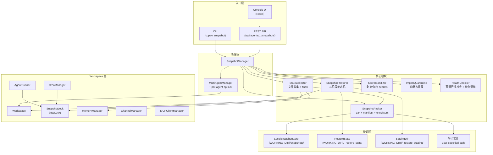
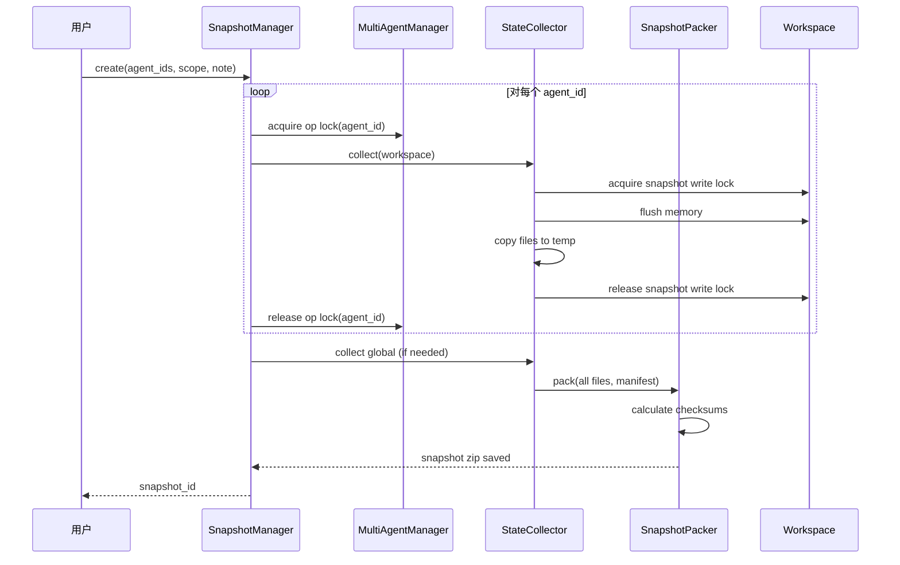
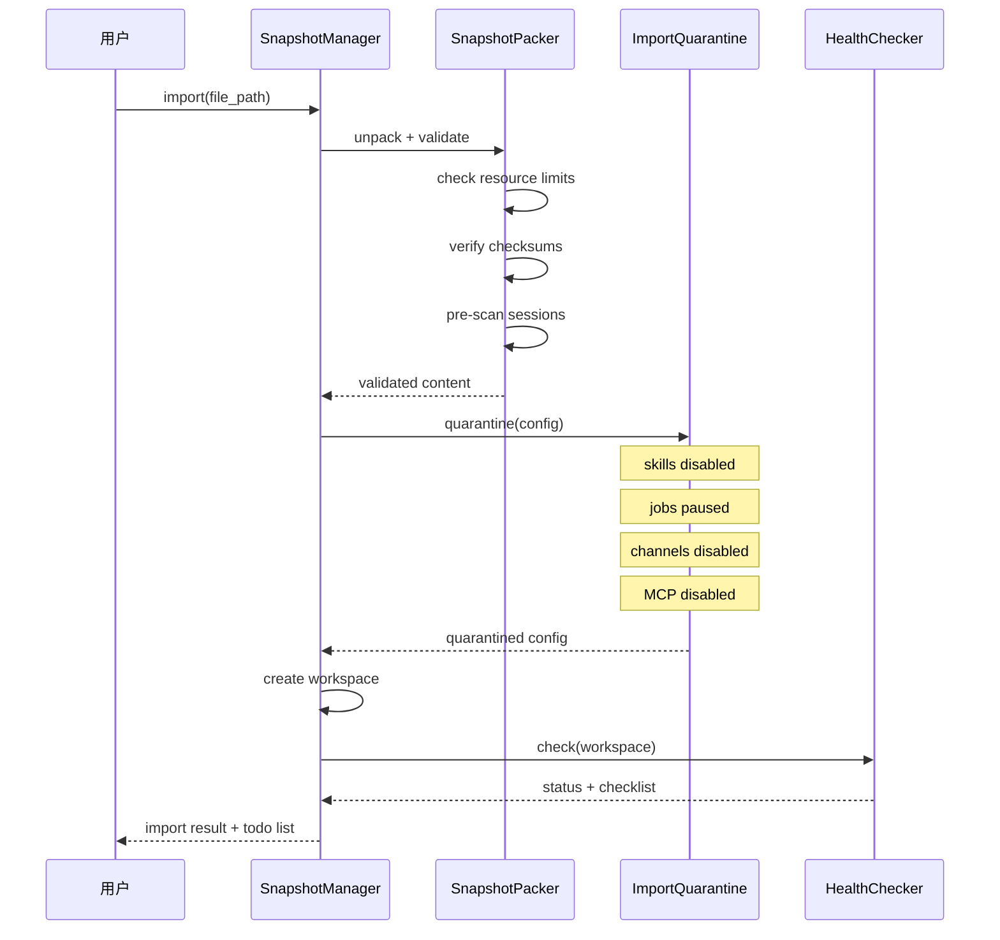

# CoPaw Snapshot 功能方案设计 v2

> 经过两轮 review 修订，日期: 2026-04-08

---

## 一、需求分析

### 1.1 背景与动机

CoPaw 是一个多 Agent 的 AI 助手框架，用户在使用过程中会逐步积累大量有价值的状态：对话记忆、定制技能、系统提示词、定时任务配置、渠道连接等。这些状态一旦丢失或损坏，恢复成本极高。

当前系统缺乏对这些状态的统一管理能力，用户面临以下痛点：

**痛点 1 - 无法回滚：** 用户修改 Agent 配置（如 system prompt、技能、渠道）后发现效果变差，没有办法回到之前的状态。

**痛点 2 - 无法迁移：** 用户更换设备（如从开发机迁移到服务器），需要手动拷贝配置文件，容易遗漏或出错。

**痛点 3 - 无法分享：** 团队中有人搭建了好用的 Agent，其他人想复用，没有标准化的导出/导入流程。

**痛点 4 - 数据安全焦虑：** 用户担心系统故障导致数据丢失，但没有备份工具。

### 1.2 目标用户

| 用户类型 | 核心需求 | 使用频率 |
|----------|----------|----------|
| 个人开发者 | 本地备份/回滚，防止配置搞坏 | 偶尔（配置变更前后） |
| 运维人员 | 跨设备迁移，灾难恢复 | 定期备份 + 迁移时 |
| 团队负责人 | 导出 Agent 模板分享给团队成员 | 团队 onboarding 时 |
| AI 爱好者 | 导入社区分享的 Agent 快照 | 探索新 Agent 时 |

### 1.3 核心场景

| 编号 | 场景 | 描述 |
|------|------|------|
| S1 | 配置回滚 | 修改 system prompt 后效果变差，回到上一个版本 |
| S2 | 定期备份 | 每周创建一次快照，作为安全网 |
| S3 | 设备迁移 | 从 Windows 笔记本迁移到 Linux 服务器 |
| S4 | 模板分享 | 导出配置好的 Agent 给团队成员使用 |
| S5 | 社区导入 | 从社区下载他人分享的 Agent 快照并导入 |
| S6 | A/B 测试 | 克隆当前 Agent，在副本上尝试新配置 |

### 1.4 非目标（V1 不做）

- 实时同步 / 多设备自动同步
- 增量快照 / 差异备份
- 快照的云端存储和管理
- 全局恢复（多 Agent 同时恢复）
- 跨平台路径自动修复

---

## 二、功能清单

### 2.1 V1 功能范围

| 功能 | 优先级 | 入口 | 说明 |
|------|--------|------|------|
| 创建本地快照 | P0 | CLI + API + UI | 快照单个/多个/全部 Agent 的完整 workspace |
| 列出快照 | P0 | CLI + API + UI | 展示时间、大小、描述、包含内容摘要 |
| 原地恢复快照 | P0 | CLI + API + UI | 回滚到之前的状态，需确认 |
| 导出快照 | P0 | CLI + API + UI | 生成可分享的 ZIP 文件，默认剥离 secrets |
| 导入快照 | P0 | CLI + API + UI | 导入外部 ZIP，进入静默态 + 待办清单 |
| 删除快照 | P0 | CLI + API + UI | 删除指定快照文件 |
| 克隆恢复 | P1 | CLI + API | 从快照创建新 Agent（不影响现有） |
| 加密导出 | P1 | CLI + API | AES-256-GCM 密码加密 |
| 清理历史备份 | P1 | CLI + API | `snapshot prune` 清理 `.backup.*` 和旧快照 |
| 多 Agent 快照 | P0 | CLI + API + UI | 快照选定的多个 Agent（含"所有 Agent"选项） |
| 导入修复向导 | P1 | UI | 引导用户完成导入后的配置修复 |
| 快照大小预估 | P2 | CLI + UI | 创建前预估并提示用户 |
| 排除选项 | P2 | CLI | `--exclude-sessions` / `--exclude-memory` |

### 2.2 V1 不做（明确延期）

| 功能 | 延期原因 |
|------|----------|
| 全局恢复 | 多 Agent 冲突解决策略复杂 |
| 增量快照 | 全量快照已满足 V1 需求 |
| 跨平台路径自动修复 | V1 只做检测和报告 |
| 多种加密格式 | V1 固定 AES-256-GCM |
| 快照签名 / HMAC | 无中心化分发平台，安全防线在行为层 |
| 自动定时快照 | 用户手动触发即可 |

---

## 三、用户旅程

### 3.1 场景 S1：配置回滚

```
用户修改了 system prompt，发现 Agent 回答质量下降，想回到之前的状态。

1. 用户意识到需要回滚
   -> Console 侧边栏「设置」分组 → 点击「快照」
   -> 看到快照列表，找到"修改 prompt 前"的那个快照

2. 用户点击"恢复"
   -> 弹出确认对话框：
      "恢复快照仅回滚 CoPaw 本地配置和数据。
       已通过渠道发送的消息、已执行的定时任务不会被撤销。
       确认恢复到快照 'v2-stable-prompt' (2026-04-07 14:30)？"
   -> 用户点击"确认恢复"

3. 系统执行恢复
   -> 显示进度条
   -> "恢复完成。Agent 已回到 2026-04-07 14:30 的状态。"

4. 用户验证
   -> 在 Console 中与 Agent 对话，确认回答质量恢复正常
```

**前置条件：** 用户在修改 prompt 前创建了快照。

**改进点（引导）：** 当用户在 Console 中修改 system prompt / 技能配置时，提示"建议在修改前创建快照"（非强制）。

### 3.2 场景 S3：设备迁移

```
用户从 Windows 笔记本迁移 Agent 到 Linux 服务器。

1. 在 Windows 上导出
   -> copaw snapshot create default --note "迁移到服务器"
   -> copaw snapshot export <snapshot_id> --output ./my-agent.zip
   -> 系统提示："导出完成。不含 API Key 等敏感信息。"
   -> 用户通过 scp/网盘将 my-agent.zip 传输到服务器

2. 在 Linux 服务器上导入
   -> copaw snapshot import ./my-agent.zip
   -> 系统输出两阶段反馈：

   阶段 1/2: 文件导入完成
     - agent.json ✓
     - 2 个技能已导入（已禁用，待审核）
     - 8 个对话历史已导入
     - 对话历史: 8 个可用, 0 个不兼容
     - 路径兼容性: 检测到 2 处 Windows 路径引用 ⚠️

   阶段 2/2: 可运行性检查
     Agent 状态: needs_setup
     - Provider "openai": API Key 未配置 [必须]
     - Channel "dingtalk": 需要重新认证 [必须]

   导入完成。以下是让 Agent 完全就绪的待办事项：
    1. [必须] 配置 Provider API Key
       -> copaw config provider set openai --api-key <YOUR_KEY>
    2. [必须] 重新认证 Channel
       -> 在 Console 中配置
    3. [建议] 审核并启用技能 (2 个待审核)
       -> copaw skill enable <skill_name>

3. 用户按待办清单逐项修复
   -> 配置 API Key
   -> 审核并启用技能
   -> Agent 状态变为 ready
```

### 3.3 场景 S5：社区导入（安全敏感）

```
用户从社区下载了一个"优秀客服 Agent"的快照并导入。

1. 用户导入
   -> copaw snapshot import ./community-agent.zip --agent-id customer-service
   -> 系统创建新 Agent "customer-service"

2. 系统进入静默态
   -> 所有技能: 已禁用（待审核）
   -> 所有定时任务: 已暂停
   -> 所有渠道: 未连接
   -> 所有 MCP: 未连接
   -> Agent Runner: 正常启动（可通过 Console 测试对话）

3. 用户审核
   -> Console 中查看 Agent 状态标签: "needs_review"（黄色）
   -> 点击进入修复向导
   -> 逐个查看技能内容，决定是否启用
   -> 检查定时任务的触发条件和动作
   -> 确认后逐项启用

4. 用户测试
   -> 在 Console 中与 Agent 对话，验证功能
   -> 满意后连接渠道，Agent 上线

关键安全保障:
  - 即使快照中包含恶意技能/定时任务，在用户主动审核并启用前不会执行
  - 即使 manifest 中的 source_hint 被篡改为 "local"，也不影响安全判定
```

### 3.4 场景 S6：A/B 测试（克隆）

```
用户想尝试新的 system prompt，但不确定效果。

1. 创建快照
   -> copaw snapshot create default --note "A/B 测试基线"

2. 克隆为新 Agent
   -> copaw snapshot restore <snapshot_id> --as default-experiment
   -> 系统创建 "default-experiment"，与原 Agent 完全相同

3. 在克隆上实验
   -> 修改 default-experiment 的 system prompt
   -> 在 Console 中对比两个 Agent 的回答

4. 决定结果
   -> 如果新版更好: 保留 default-experiment，删除或归档 default
   -> 如果原版更好: 删除 default-experiment，原 Agent 不受影响
```

---

## 四、状态全景分析

### 4.1 Per-Workspace 状态（每个 Agent 独立拥有）

| 状态 | 文件/路径 | 格式 | 重要性 | 备注 |
|------|-----------|------|--------|------|
| Agent 配置 | `{workspace}/agent.json` | JSON | 核心 | channels, MCP, system_prompt, tools, security 等 |
| 聊天列表 | `{workspace}/chats.json` | JSON | 核心 | ChatSpec 元数据（id, name, session_id 等） |
| 对话历史 | `{workspace}/sessions/*.json` | JSON | 核心 | AgentScope state_dict，可能很大 |
| 定时任务 | `{workspace}/jobs.json` | JSON | 核心 | CronJobSpec 定义 |
| 技能清单 | `{workspace}/skill.json` | JSON | 核心 | workspace-skill-manifest |
| 技能内容 | `{workspace}/skills/*/` | 目录树 | 核心 | SKILL.md + scripts + references |
| Markdown 记忆 | `{workspace}/memory/*.md` | Markdown | 核心 | AgentMdManager 管理 |
| 向量记忆 | `{workspace}/` 下 ReMe 管理的文件 | SQLite/Chroma | 核心 | 可能包含二进制文件 |
| 系统提示文件 | `{workspace}/AGENTS.md`, `SOUL.md` 等 | Markdown | 重要 | 由 agent.json 的 system_prompt_files 引用 |

### 4.2 全局状态（所有 Agent 共享）

| 状态 | 文件/路径 | 格式 | 重要性 |
|------|-----------|------|--------|
| 根配置 | `{WORKING_DIR}/config.json` | JSON | 核心 |
| UI 设置 | `{WORKING_DIR}/settings.json` | JSON | 次要 |
| 共享技能池 | `{WORKING_DIR}/skill_pool/` | 目录树+JSON | 重要 |
| Token 用量 | `{WORKING_DIR}/token_usage.json` | JSON | 次要 |
| 心跳文件 | `{WORKING_DIR}/HEARTBEAT.md` | Markdown | 次要 |
| 自定义渠道 | `{WORKING_DIR}/custom_channels/` | Python 模块 | 特殊 |

### 4.3 敏感状态（SECRET_DIR）

| 状态 | 文件/路径 | 格式 | 安全等级 |
|------|-----------|------|----------|
| Provider 配置 | `{SECRET_DIR}/providers/builtin/*.json` | JSON | 高（含 API Key） |
| 自定义 Provider | `{SECRET_DIR}/providers/custom/*.json` | JSON | 高（含 API Key） |
| 环境变量 | `{SECRET_DIR}/envs.json` | JSON | 高（可能含密钥） |
| 认证配置 | `{SECRET_DIR}/auth.json` | JSON | 高（含 JWT secret, 密码哈希） |

### 4.4 纯运行时状态（不持久化，无需 snapshot）

- 内存中的 ReMe 缓存（未 flush 的部分）
- CronManager 的 scheduler 和 job state
- TaskTracker 的活跃任务
- LLM 正在进行的流式响应
- WebSocket 连接状态
- Channel 的在线连接（DingTalk/Discord bot session 等）
- 技能环境变量覆盖的引用计数

---

## 五、架构设计

### 5.1 系统架构



### 5.2 数据流

**创建快照：**



**导入快照：**



### 5.3 存储目录布局

```
{WORKING_DIR}/
  config.json                          # 全局配置
  settings.json                        # UI 设置
  skill_pool/                          # 共享技能池
  snapshots/                           # 本地快照存储
    snap-{id}.zip                      # 各快照文件
  _restore_state/                      # 恢复状态机持久化
    {agent_id}.json                    # 每个 agent 的恢复状态
  _restore_staging/                    # 恢复临时目录
    {agent_id}/                        # 解压的 staging 内容
  workspaces/
    {agent_id}/                        # 各 agent 的 workspace
      agent.json
      chats.json
      sessions/
      jobs.json
      skill.json
      skills/
      memory/
      ...
    {agent_id}.backup.{timestamp}/     # 恢复时的自动备份

{SECRET_DIR}/
  providers/
  envs.json
  auth.json
```

### 5.4 模块职责

| 模块 | 文件路径 | 职责 |
|------|----------|------|
| SnapshotManager | `src/copaw/app/snapshot/manager.py` | 顶层协调器，管理快照生命周期；通过 MultiAgentManager 获取 op lock |
| StateCollector | `src/copaw/app/snapshot/collector.py` | 收集 workspace 文件，处理 flush 和 snapshot 写锁 |
| SnapshotPacker | `src/copaw/app/snapshot/packer.py` | 打包/解包 ZIP，生成 manifest，计算校验和，资源限制检查 |
| SnapshotRestorer | `src/copaw/app/snapshot/restorer.py` | 三阶段状态机恢复逻辑，崩溃恢复检查 |
| SecretSanitizer | `src/copaw/app/snapshot/sanitizer.py` | 剥离敏感信息、AES-256-GCM 加密/解密 |
| ImportQuarantine | `src/copaw/app/snapshot/quarantine.py` | 导入后静默态处理，禁用 skills/jobs/channels/MCP |
| HealthChecker | `src/copaw/app/snapshot/health.py` | 可运行性检查，生成待办清单，判定 agent 状态 |

### 5.5 MultiAgentManager 变更

- 新增 `_agent_op_locks: Dict[str, asyncio.Lock]` 字段
- 新增 `_get_agent_op_lock(agent_id)` 方法
- `reload_agent()` 改为在 op lock 内执行
- 新增 `get_agent_op_lock(agent_id)` 公开方法供 SnapshotManager 调用
- 启动时扫描 `{WORKING_DIR}/_restore_state/` 执行崩溃恢复

---

## 六、核心设计决策

### 6.1 Snapshot 粒度：灵活的 Agent 范围选择

**决策：** 创建快照时，用户可选择三种范围：**单个 Agent**、**指定多个 Agent**、**所有 Agent（全量备份）**。

**理由：**

- 最常见场景是备份/回滚某个特定 Agent（单个）
- 设备迁移场景需要一次性备份所有 Agent + 全局配置（全量）
- 部分备份场景需要选择一组相关 Agent（指定多个）
- 快照功能是系统级功能（位于"设置"模块下），不局限于某个 Agent 的工作空间

**三种范围：**

| 范围 | CLI | UI 入口 | 说明 |
|------|-----|---------|------|
| 当前 Agent | `snapshot create <agent_id>` | 创建 Modal 默认选项 | 仅快照该 workspace |
| 指定 Agent | `snapshot create --agents a,b,c` | 创建 Modal 多选面板 | 快照选定的多个 workspace |
| 所有 Agent | `snapshot create --all` | 创建 Modal 全量选项 | 快照所有 workspace + 自动包含全局配置 |

**补充选项：**
- `--include-secrets` - 可选包含 provider 配置和密钥信息
- `--include-global` - 可选包含全局 config + skill_pool（"所有 Agent"时自动包含）
- `--exclude-sessions` / `--exclude-memory` - 排除大体积数据
- **V1 不支持全局恢复**，多 Agent 快照只能按单个 agent 逐一恢复

**UI 位置：** 快照管理页面位于侧边栏 **设置** 分组中，与"Agent 管理""模型""环境变量"等同级，而非放在某个 Agent 的"工作空间"下。理由：快照可涵盖全局配置和多个 Agent，属于系统级功能。

### 6.2 Snapshot 存储格式

**决策：** 使用 **ZIP 归档 + manifest.json 清单文件**。

```
copaw-snapshot-{scope}-{timestamp}.zip
  manifest.json               # 元数据、版本、校验和
  workspaces/                  # 各 agent 的 workspace（支持多个）
    {agent_id}/                # 例如 default/
      agent.json
      chats.json
      sessions/
      jobs.json
      skill.json
      skills/
      memory/
      ...
    {agent_id_2}/              # 多 Agent 时包含多个子目录
      ...
  secrets/                     # 可选，加密存储
    providers/
    envs.json
  global/                      # 可选（"所有 Agent"时自动包含）
    config.json
    settings.json
    skill_pool/
```

> 单个 Agent 快照的文件名示例：`copaw-snapshot-default-20260408.zip`
> 多 Agent 快照的文件名示例：`copaw-snapshot-selected-20260408.zip`
> 全量快照的文件名示例：`copaw-snapshot-all-20260408.zip`

**manifest.json 结构：**

```json
{
  "schema_version": 1,
  "copaw_version": "0.x.y",
  "agentscope_version": "0.x.y",
  "created_at": "2026-04-08T12:00:00Z",
  "agent_ids": ["default"],
  "scope": "single",
  "original_platform": "linux",
  "python_version": "3.11.5",
  "source_hint": "local",
  "includes_secrets": false,
  "includes_global": false,
  "file_checksums": {
    "workspaces/default/agent.json": "sha256:...",
    "workspaces/default/chats.json": "sha256:..."
  },
  "reme_backend": "local",
  "notes": "user-provided description"
}
```

**字段说明：**

- `agent_ids`: 快照包含的 Agent ID 列表。单个 Agent 时为 `["default"]`，多 Agent 时为 `["default", "customer-svc", ...]`
- `scope`: 快照范围，取值 `"single"` / `"selected"` / `"all"`
- `agentscope_version`: 记录 AgentScope 库版本，用于判断 `sessions/*.json` 兼容性
- `source_hint`: 仅作展示用途（如"由哪台机器创建"），**不参与任何安全决策**
- `file_checksums`: 用于检测传输/存储过程中的意外损坏（防损坏，不防篡改）

### 6.3 信任模型

快照的信任级别由**代码路径**决定，而非由包内容声明：

| 操作路径 | 信任级别 | 行为 |
|----------|----------|------|
| `SnapshotManager.restore(snapshot_id)` 从 `{WORKING_DIR}/snapshots/` 读取 | trusted | skills/jobs/channels 保持原样 |
| `SnapshotManager.import_snapshot(file_path)` 用户上传或指定的 ZIP | untrusted | 进入"导入后静默态"（见 6.5 节） |

**设计原则：** 任何用户上传或选择的 ZIP 文件，一律视为 untrusted。`import_snapshot()` 函数硬编码 `trusted=False`，不读取 manifest 中的任何字段来覆盖此判定。

### 6.4 敏感数据处理策略

CoPaw 中的"快照"分为两种不同的产物，敏感数据策略也不同：

**本地快照（Local Snapshot）：**
- 存储路径：`{WORKING_DIR}/snapshots/`，与 `SECRET_DIR` 在同一台机器上
- **默认包含 secrets**，因为本地恢复需要完整的 API Key / Token 才能正常运行
- 文件权限：Linux/macOS 下设置 `0600`；Windows 下通过 `os` 模块设置仅当前用户可读写的 ACL
- **注意：** 本地快照不建议上传到网盘（OneDrive/iCloud/Google Drive）或通过 IM 发送。如需跨设备传输，请使用"导出"功能

**导出包（Export Package）：**
- 用户主动导出的 ZIP 文件，会离开本机
- **默认剥离 secrets**：`agent.json` 中的 `client_secret`、channel token 等字段替换为占位符 `"<REDACTED>"`
- 使用 `--include-secrets` 时要求用户输入 `YES` 确认（而非 `y/n`），并在文件名中标记 `[CONTAINS-SECRETS]`
- `--encrypt` 标志启用加密导出，默认推荐含 secrets 时使用加密

**加密方案（V1 固定 AES-256-GCM）：**
- 使用 Python `cryptography` 库
- 算法：AES-256-GCM（AEAD，自带认证标签）
- KDF：PBKDF2-HMAC-SHA256，迭代次数 >= 600,000
- 加密包格式：版本头（1 byte, 固定 `0x01`）+ 随机盐（16 bytes）+ 随机 nonce（12 bytes）+ 密文（含 16 bytes GCM tag）
- 解密失败时返回：`"解密失败：密码错误或文件已损坏/被篡改"`（GCM tag 验证无法精确区分两种情况）
- 未来如需支持新算法，通过版本头区分

**操作对照表：**

| | 本地快照 | 导出包 | 导入包 |
|------|---------|--------|--------|
| **目的** | 本机回滚/备份 | 跨设备迁移或分享 | 接收外部 agent |
| **创建命令** | `snapshot create` | `snapshot export` | N/A |
| **使用命令** | `snapshot restore` | N/A（发送给对方） | `snapshot import` |
| **默认含 secrets** | 是 | 否 | N/A |
| **适合分享** | 否（含 secrets） | 是 | N/A |
| **信任级别** | trusted | N/A | untrusted |
| **skills 状态** | 保持原样 | 保持原样 | 默认禁用 |
| **jobs/channels/MCP** | 保持原样 | 保持原样 | 默认禁用 |
| **风险提示** | 不要上传到网盘/IM | 确认是否含 secrets | 审核后再启用组件 |

### 6.5 导入后静默态（Post-Import Quiescent State）

对 untrusted 导入包，所有"主动对外动作"的组件在导入后默认处于非活跃状态：

| 组件 | 导入后默认状态 | 用户激活方式 |
|------|---------------|-------------|
| Skills | `enabled: false`（在 `skill.json` 中） | 逐个审核后手动启用 |
| Cron Jobs | `enabled: false`（在 `jobs.json` 中） | 审核后手动启用 |
| Channels | 不自动连接（标记 `_imported_disabled: true`） | 重新认证后启用 |
| MCP Clients | 不自动连接（标记 `_imported_disabled: true`） | 用户确认后手动连接 |
| Agent 核心（Runner） | 正常启动 | 即时可用（通过 Console 聊天） |

**Runner 保持启动的理由：** 用户需要通过 Console 与 Agent 交互来验证导入是否正确。被禁用的是"主动对外动作"的能力，而非 Agent 的基本对话能力。

### 6.6 导入后 Agent 状态

导入完成后，根据可运行性检查结果，Agent 处于以下三种状态之一：

| 状态 | 含义 | UI 展示 |
|------|------|---------|
| `needs_setup` | 缺少必要配置（如 Provider API Key），Agent 无法正常对话 | 红色标签 + 修复向导入口 |
| `needs_review` | 可以对话，但有组件待审核/启用（skills, jobs, channels） | 黄色标签 + 待办清单入口 |
| `ready` | 所有组件就绪，功能完整 | 绿色标签 |

---

## 七、并发模型

### 7.1 两层锁架构

**外层：Per-Agent Lifecycle Lock（在 `MultiAgentManager` 中）**

串行化所有改变 agent 生命周期的操作。同一 agent 的操作串行执行，不同 agent 之间可并行。

```python
class MultiAgentManager:
    def __init__(self):
        self.agents: Dict[str, Workspace] = {}
        self._lock = asyncio.Lock()
        self._agent_op_locks: Dict[str, asyncio.Lock] = {}
```

以下操作必须持有 per-agent op lock：

| 操作 | 锁行为 |
|------|--------|
| `reload_agent(agent_id)` | 持有 op lock |
| `stop_agent(agent_id)` | 持有 op lock |
| `snapshot_create(agent_id)` | 持有 op lock |
| `snapshot_restore(agent_id)` | 持有 op lock |
| `snapshot_export(agent_id)` | 持有 op lock |
| `snapshot_import(agent_id)` | 持有 op lock |

`schedule_agent_reload()` 在 snapshot/restore 期间的行为：排队等待（排队语义，而非拒绝或取消）。

重复请求（如用户重复点击）：API 层检测到 op lock 已被持有时，返回 409 Conflict 和当前任务进度。

**内层：Snapshot Lock（在 `Workspace` 内部，读写锁）**

| 入口点 | 锁行为 |
|--------|--------|
| `AgentRunner.run()`（聊天请求） | 持有读锁 |
| `CronManager` 任务执行 | 持有读锁 |
| `SnapshotManager.create()` | 持有写锁（暂停请求处理，flush 内存） |

写锁期间，新的聊天请求在 `runner.run()` 入口处排队等待（不丢弃），超时后返回"系统正在维护"。

**两层锁的关系：** op lock 是外层粗粒度锁（串行化生命周期操作），snapshot_lock 是内层细粒度锁（协调请求处理和文件收集）。

---

## 八、功能设计

### 8.1 创建 Snapshot

```
确定范围（单个/多个/全部 Agent）
  -> 对每个 agent_id:
       获取 op lock -> 验证 agent 存在 -> 获取 snapshot 写锁 -> flush 内存
       -> 收集文件到临时目录 -> 释放写锁 -> 释放 op lock
  -> 若含全局配置: 收集 global 文件
  -> 计算校验和 -> 打包 -> 保存
```

### 8.2 恢复 Snapshot（三阶段状态机）

**状态文件位置：** `{WORKING_DIR}/_restore_state/{agent_id}.json`（稳定路径，不随目录重命名移动）

**状态文件结构：**

```json
{
  "phase": "applying",
  "agent_id": "default",
  "workspace_dir": "/home/user/.copaw/workspaces/default",
  "backup_dir": "/home/user/.copaw/workspaces/default.backup.20260408120000",
  "staging_dir": "/home/user/.copaw/_restore_staging/default",
  "snapshot_id": "snap-abc123",
  "started_at": "2026-04-08T12:00:00Z",
  "last_completed_step": "workspace_renamed_to_backup"
}
```

**三阶段流程：**

```
PHASE 1: PREPARE
  获取 op lock
  校验 manifest 和 file_checksums
  检查磁盘空间（需要 2x snapshot 大小 + 当前 workspace 大小）
  解压 snapshot 到 {WORKING_DIR}/_restore_staging/{agent_id}/
  更新状态文件: last_completed_step = "staging_extracted", phase = "prepared"

PHASE 2: APPLY
  workspace.stop(final=True) -> 更新: "workspace_stopped"
  rename workspace_dir -> backup -> 更新: "workspace_renamed_to_backup"
  rename staging -> workspace_dir -> 更新: "staging_renamed_to_workspace", phase = "applied"

PHASE 3: VERIFY
  workspace.start() -> 更新: "workspace_started"
  验证核心服务
  成功: 删除状态文件
  失败: 回滚到 backup
  释放 op lock
```

**崩溃恢复（启动时扫描 `_restore_state/`）：**

| last_completed_step | 现场状态 | 恢复动作 |
|---------------------|----------|----------|
| `staging_extracted` 或更早 | staging 存在，原 workspace 完好 | 清理 staging，正常启动 |
| `workspace_stopped` | workspace 已停止但目录仍在 | 正常启动原 workspace |
| `workspace_renamed_to_backup` | 原目录已变成 backup，staging 仍存在 | 将 staging 重命名为 workspace_dir，进入 VERIFY |
| `staging_renamed_to_workspace` | 新 workspace 就位，backup 存在 | 进入 VERIFY |
| `workspace_started` | 新 workspace 已启动但未验证 | 重新验证，失败则回滚到 backup |

### 8.3 恢复的两种模式

| 模式 | 命令 | 行为 |
|------|------|------|
| 原地恢复（rollback） | `copaw snapshot restore <id>` | 覆盖当前 workspace，需确认（CLI 输入 `YES`，UI 弹确认框） |
| 克隆试跑（clone） | `copaw snapshot restore <id> --as <new_agent_id>` | 创建新 agent，不影响现有 |

默认模式为原地恢复。克隆功能通过显式的 `--as` 标志提供。

### 8.4 导出

```
获取 op lock -> 创建 snapshot -> 敏感数据处理 -> 可选加密 -> 输出 zip -> 释放 op lock
```

### 8.5 导入

```
获取 op lock -> 接收 zip -> 可选解密 -> 校验 manifest -> 资源限制检查
  -> 版本兼容检查 -> session 预扫描 -> 静默态处理 -> 创建 workspace
  -> 可运行性检查 -> 生成待办清单 -> 释放 op lock
```

**导入两阶段反馈：**

```
阶段 1/2: 文件导入完成
  - agent.json ✓
  - 3 个技能已导入（已禁用，待审核）
  - 2 个定时任务已导入（已暂停）
  - Channels: 已导入但未连接（待认证）
  - MCP: 已导入但未连接（待确认）
  - 对话历史: 10 个可用, 2 个不兼容（已归档）

阶段 2/2: 可运行性检查
  Agent 状态: needs_setup
  - Provider "openai": API Key 未配置 [必须]
  - Channel "dingtalk": 需要重新认证 [必须]
  - 技能依赖 "pandas": 未安装 [建议]
```

**导入后待办清单：**

```
导入完成。以下是让 Agent 完全就绪的待办事项：

 1. [必须] 配置 Provider API Key
    -> copaw config provider set openai --api-key <YOUR_KEY>
 2. [必须] 重新认证 Channel
    -> Console -> Channels -> dingtalk -> 重新配置
 3. [建议] 安装技能依赖
    -> pip install pandas
 4. [建议] 审核并启用技能 (3 个待审核)
    -> copaw skill enable <skill_name>
 5. [建议] 审核并启用定时任务 (2 个已暂停)
    -> copaw job enable <job_id>
 6. [建议] 确认并连接 MCP 服务
    -> Console -> MCP -> 逐个确认连接
```

---

## 九、边缘情况与用户问题

### 9.1 一致性问题

| 场景 | 风险 | 应对策略 |
|------|------|----------|
| Snapshot 期间有活跃的聊天流式响应 | Session 文件半写入 | snapshot 写锁等待进行中请求完成，30s 超时后中断 |
| Snapshot 期间 CronJob 正在执行 | 类似活跃聊天 | CronManager 任务也持有 snapshot 读锁 |
| ReMe 内存数据未 flush | 恢复后丢失记忆 | Snapshot 前显式 flush/save |
| Channel 正在接收消息 | 消息排队延迟 | 写锁期间新请求排队等待，超时后返回"系统维护中" |

### 9.2 恢复失败场景

| 场景 | 风险 | 应对策略 |
|------|------|----------|
| 恢复过程中崩溃 | workspace 处于中间状态 | 三阶段状态机 + 启动时自动恢复（见 8.2 节） |
| 磁盘空间不足 | 解压中途失败 | PREPARE 阶段预检空间；失败时清理 staging |
| 文件权限问题 | Windows/Linux 不同 | 忽略原始权限，使用当前平台默认；Windows 用 ACL |
| Snapshot 文件损坏 | 解压失败 | PREPARE 阶段校验 SHA-256 + ZIP CRC |
| Windows 文件占用 | 目录重命名失败 | APPLY 阶段先 workspace.stop() 释放句柄 |

### 9.3 跨设备/跨平台迁移

| 场景 | 风险 | 应对策略 |
|------|------|----------|
| Windows/Linux 路径差异 | 绝对路径引用 | V1 只检测报告，不自动修复 |
| CoPaw 版本不同 | 配置 schema 不兼容 | manifest 记录版本；导入时 migration 检查 |
| Agent ID 冲突 | 同名 agent 已存在 | 默认重命名；覆盖需 `--force` 或 UI 二次确认 |
| AgentScope 版本不匹配 | session 反序列化失败 | 导入时预扫描 sessions 并汇总报告 |
| ReMe 后端不一致 | Chroma vs local | manifest 记录；导入时检查环境支持 |
| 技能依赖缺失 | pip 包未安装 | 待办清单中提示安装 |

### 9.4 安全相关

| 场景 | 风险 | 应对策略 |
|------|------|----------|
| 误导出含 API Key 的快照 | 密钥泄露 | 默认剥离；`--include-secrets` 需输入 YES；文件名标记 |
| 加密快照解密失败 | 无法区分原因 | 统一提示"密码错误或文件已损坏/被篡改" |
| 导入恶意快照 | 恶意代码/任务 | 导入后静默态：全部默认禁用 |
| 路径遍历攻击 | zip slip | 验证所有路径；跳过符号链接/硬链接 |
| auth.json 覆盖 | 认证失效 | 导入时不覆盖现有认证配置 |
| 资源炸弹 | zip bomb | 资源限制（见 9.7 节） |

### 9.5 用户体验陷阱

| 场景 | 风险 | 应对策略 |
|------|------|----------|
| 文件过大 | 用户以为卡死 | 进度条 + 预估时间 + 取消 + 排除选项 |
| 恢复后 Channel 需重新认证 | token 过期 | 可运行性检查 + 待办清单 |
| 用户以为恢复等于"撤销" | 外部副作用不回滚 | 确认对话框明确说明 |
| 重复点击操作 | 并发竞争 | op lock + 409 Conflict |
| 导入后不知道下一步 | 用户迷失 | 有序待办清单 + UI 修复向导 |

### 9.6 并发与竞态

| 场景 | 风险 | 应对策略 |
|------|------|----------|
| 同时创建两个 snapshot | 冲突 | per-agent op lock，第二个返回 409 |
| Snapshot 时触发 reload | 生命周期竞争 | reload 在 op lock 处排队等待 |
| restore 时后台 reload | 双实例同一目录 | op lock 阻止 reload 在 restore 完成前启动 |

### 9.7 导入资源限制

| 维度 | 默认限制 | 可配置 |
|------|----------|--------|
| 解压后总大小 | 2 GB | 是 |
| 单文件大小 | 500 MB | 是 |
| 文件数量 | 10,000 | 是 |
| 最大路径深度 | 20 级 | 否 |
| 最大路径长度 | 260 字符 | 否 |
| 压缩比阈值 | > 100 时拒绝 | 否 |

解压过程中实时统计，超限立即中止并清理。符号链接和硬链接一律跳过。

---

## 十、API 设计

### 10.1 REST API

```
# 快照管理（系统级，位于 Settings 模块）
POST   /api/snapshots                              # 创建快照（body 中指定 scope + agent_ids）
GET    /api/snapshots                              # 列出所有快照
GET    /api/snapshots/{id}                         # 快照详情
DELETE /api/snapshots/{id}                         # 删除快照
POST   /api/snapshots/{id}/restore                 # 恢复（body 中指定 agent_id + mode）
GET    /api/snapshots/{id}/export                  # 导出（下载 zip）
POST   /api/snapshots/import                       # 导入（上传 zip）
```

**创建快照请求示例：**

```json
POST /api/snapshots
{
  "scope": "selected",
  "agent_ids": ["default", "customer-svc"],
  "include_secrets": true,
  "include_global": false,
  "exclude_sessions": false,
  "exclude_memory": false,
  "note": "修改 prompt 前的备份"
}
```

> **注意：** API 从 `/api/agents/{agentId}/snapshots` 改为 `/api/snapshots`，因为快照是系统级功能，可跨多个 Agent。

### 10.2 CLI

```bash
copaw snapshot create [agent_id]                       # 快照单个 Agent（默认当前）
copaw snapshot create --agents a,b,c                   # 快照指定多个 Agent
copaw snapshot create --all                            # 全量快照（所有 Agent + 全局配置）
copaw snapshot create [options] [--note "..."] [--include-secrets] [--include-global]
                                [--exclude-sessions] [--exclude-memory]
copaw snapshot list                                    # 列出所有快照
copaw snapshot restore <snapshot_id>                   # 原地恢复（需确认）
copaw snapshot restore <snapshot_id> --as <new_id>     # 克隆到新 agent
copaw snapshot export <snapshot_id> [--output <path>] [--encrypt]
copaw snapshot import <file_path> [--agent-id <id>] [--force]
copaw snapshot delete <snapshot_id>
copaw snapshot prune [--keep <N>]
```

---

## 十一、已确认的设计决策

1. **自动快照** - 不做自动快照，全部由用户手动触发
2. **增量快照** - 第一版不做，每次全量快照（ZIP 打包完整 workspace）
3. **快照大小** - 不限制大小，但创建前预估并提示；提供 `--exclude-sessions` / `--exclude-memory` 排除选项
4. **ReMe 向量存储可移植性** - 同时保留二进制和纯文本记忆导出；不兼容时回退到纯文本重建索引
5. **Console UI** - 第一版就做完整 UI（列表、创建、恢复、导入导出、进度条、修复向导等）
6. **全局恢复** - V1 只支持全局/多 Agent 快照创建，不支持一键全局恢复（只能逐 Agent 恢复）
7. **跨平台路径** - V1 只做检测和报告，不做自动修复
8. **加密格式** - V1 固定 AES-256-GCM 单一方案
9. **快照范围** - 支持三种粒度：单个 Agent、指定多个 Agent、所有 Agent（全量备份）
10. **导航位置** - 快照功能放在侧边栏「设置」分组下，而非某个 Agent 的「工作空间」下（系统级功能）
11. **API 路径** - 使用 `/api/snapshots` 而非 `/api/agents/{agentId}/snapshots`（快照可跨 Agent）
